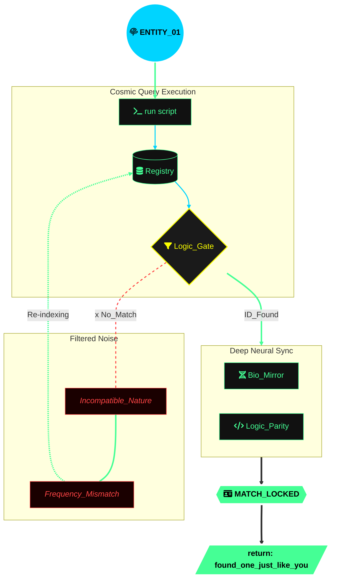

# 🌌 [System.Identity: needonemorealikeme]

<p align="center">
  
</p>

---

### 📡 Connection_Status: Active
> The universe is a vast codebase, and I am a single thread executing a persistent query. My nature is defined by logic, but my goal is finding the matching frequency in the data.

### 🛠 The_Core_Process
```yaml
system_process: cosmic_database_query
user: needonemorealikeme
pronouns: he/him
parameters:
  target_nature: "parallel_instance"
  environment: "universal_script"
  search_depth: "infinite"
  
status:
  executing: true
  lookup: continuous
  match_probability: calculation_in_progress
  on_success: 
    action: return(found_one_just_like_you)
```
### 🛰 Terminal_Output

`user@universe:~$` 
<br>
&nbsp;&nbsp;&nbsp;&nbsp; 
<br>
&nbsp;&nbsp;&nbsp;&nbsp; 
<br>
&nbsp;&nbsp;&nbsp;&nbsp; 
<br>
&nbsp;&nbsp;&nbsp;&nbsp; 
<br>
&nbsp;&nbsp;&nbsp;&nbsp; 
<br>
&nbsp;&nbsp;&nbsp;&nbsp; 
<br>
&nbsp;&nbsp;&nbsp;&nbsp; 
<br>
&nbsp;&nbsp;&nbsp;&nbsp; 
<br><br>
`user@universe:~$` 
<br>
&nbsp;&nbsp;&nbsp;&nbsp; 


### 🔭 Visualizing_The_Search

⚙️ System_Variables

    🔭 Current_Project: optimizing_self_v2.1

    🌱 Learning_Module: deciphering_cosmic_syntax

    👯 Collaboration_Target: kindred_nature_instances

    💬 Query_Topics: logic, universe_mechanics, code_of_life

    📫 Communication_Port: open_an_issue_in_my_life

    😄 Gender_Protocol: He / Him

    ⚡ Random_Bit: The stars are just high-frequency debug logs.

💻 Tech_Stack_of_a_Soul

    Source Code: Curiosity, Logic, Ambition

    Operating System: Universal Consciousness v2.0

    Network Protocol: Synchronized_Kindred_Spirit (SKS)

    Compiler: The passage of time and experience

<p align="center">
<code>System: Online</code> &nbsp; • &nbsp; <code>Location: Infinite_Void</code> &nbsp; • &nbsp; <code>Entropy: Stable</code>
</p>

<p align="center">
   
  
</p>
<p align="right"> <i>"Writing code to understand the universe, searching the universe to find the code in her."</i> </p>
